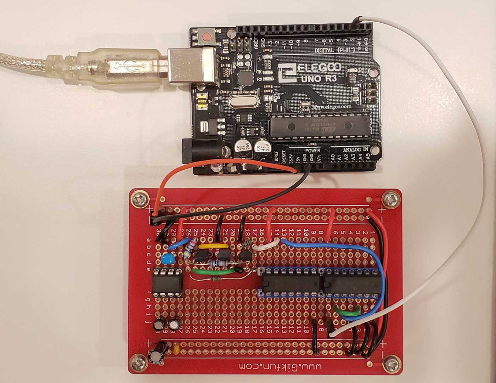

# Avalanche Noise True Random Number Generator For Arduino

Version: ≤0.2.x

## Explanation / Rant About Crappy Pseudo Random Algos

This is a true random number generator to be used with Arduino. While working with Arduino in art projects I would often want to generate a random number and I noticed that the built in 'random()' function is actually pseudo random and often kept repeating the same 12 or so numbers over and over again. providing a seed number for variety would simply shift to a different 12 or so numbers and was definitely not enough to make a unique experience for the audience of my work. Often 
I would use touch sensors to trigger a bank of audio samples, but when the interaction triggers the same 12 or so samples over and over the audience was unable to experience the hundreds of carefully selected samples I had available. After much research I discovered that although computers are very good at following instructions and doing math, they are quite bad at creating true random numbers. In fact there is an entire area of computer science dedicated to solving the random number issue. To accomplish true randomness you need something organic; a natural phenomenon observable in nature and then measure this and translate to a number. Some solutions have been things like measuring the radioactive decay of molecules, shooting video of smoke moving in the wind and then analyzing each frame, or measuring changing weather from different weather stations throughout the world. None of these are practical or portable solutions for use in an art project. Fortunately we can combine a few electrical components together to achieve randomness in a small footprint that only requires we feed our circuit a bit of electricity and watch the behavior of electrons moving through the circuit. The basic premise is that we use noise created by transistors. To use the water analogy where electrons are water.. transistors act like gates of a damn opening and closing allowing different amounts of water (electrons) through. If we reverse the current through the transistor a pile of electrons will get stored up on the other side of the gate. As other electronics pass by they may run into each other sticking to each other and pulling more electrons through the gate with them. This is like the way snow packs together causing other snow to get pulled down the mountain with it, hence the term avalanche noise. For more detailed explanation with diagrams check the link below.

## Resources

- Circuit: http://www.openrandom.org/resources/avalanche/circuit
- Transistor Data Sheet: https://pdf1.alldatasheet.com/datasheet-pdf/view/11474/ONSEMI/2N4401.html
- Parts List:http://www.openrandom.org/resources/avalanche/diy.md

## Research
- How it Works: http://www.openrandom.org/resources/avalanche/how_it_works.md
- More about Avalanche Noise: https://sites.google.com/site/astudyofentropy/project-definition/avalanche-noise
- Creating Noise in Semiconductor Devices: https://www.eng.auburn.edu/~wilambm/pap/2011/K10147_C011.pdf

## Credits

- Circuit Design by: VHS Design https://www.tindie.com/stores/robseward/
- Code by: James Grover & Jon Grover <hello@jonathangrover.com>
- Used in artwork: https://jonathangrover.com, https://circuladium.com
- Microcontroller: https://arduino.cc
- Parts from: https://mouser.com

## License

Copyright © 2022 Jonathan Grover

Permission is hereby granted, free of charge, to any person obtaining a copy of this software and associated documentation files (the “Software”), to deal in the Software without restriction, including without limitation the rights to use, copy, modify, merge, publish, distribute, sublicense, and/or sell copies of the Software, and to permit persons to whom the Software is furnished to do so, subject to the following conditions:

The above copyright notice and this permission notice shall be included in all copies or substantial portions of the Software.

THE SOFTWARE IS PROVIDED “AS IS”, WITHOUT WARRANTY OF ANY KIND, EXPRESS OR IMPLIED, INCLUDING BUT NOT LIMITED TO THE WARRANTIES OF MERCHANTABILITY, FITNESS FOR A PARTICULAR PURPOSE AND NONINFRINGEMENT. IN NO EVENT SHALL THE AUTHORS OR COPYRIGHT HOLDERS BE LIABLE FOR ANY CLAIM, DAMAGES OR OTHER LIABILITY, WHETHER IN AN ACTION OF CONTRACT, TORT OR OTHERWISE, ARISING FROM, OUT OF OR IN CONNECTION WITH THE SOFTWARE OR THE USE OR OTHER DEALINGS IN THE SOFTWARE.